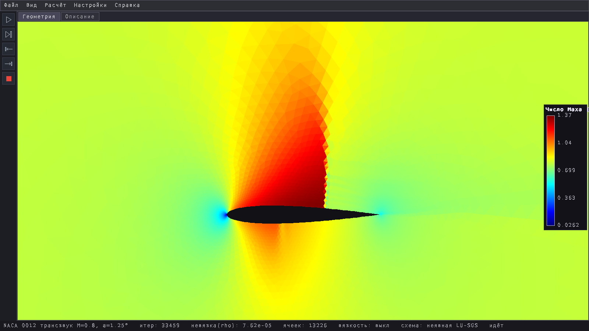
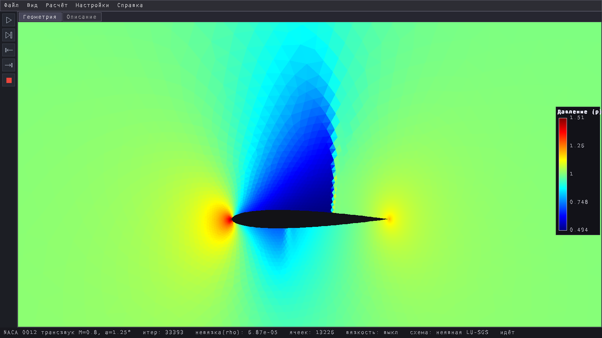
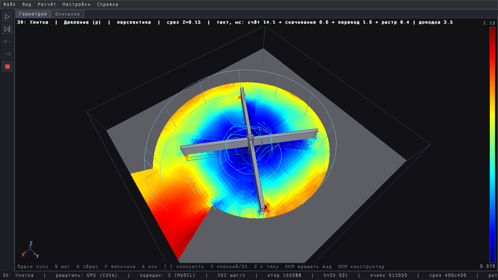
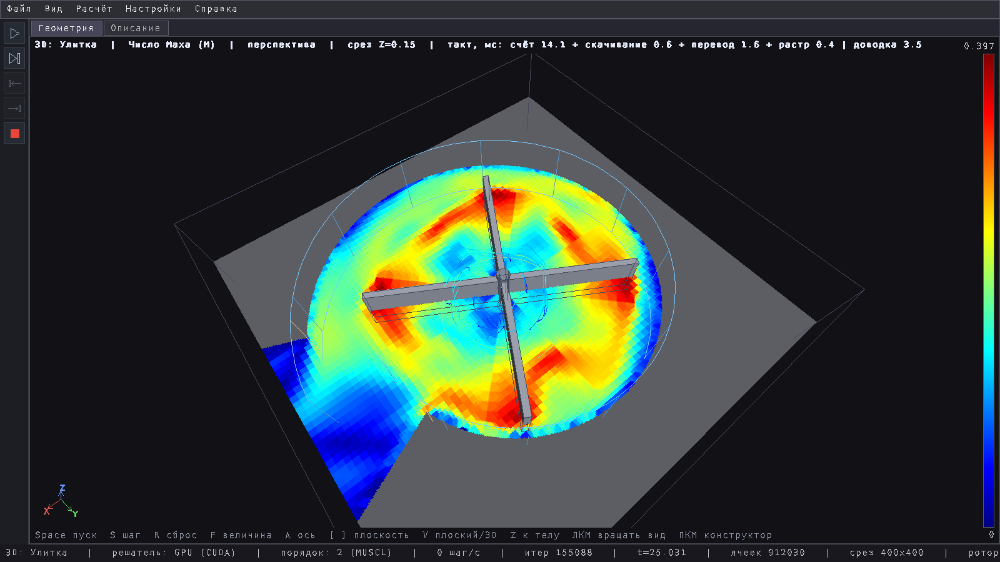
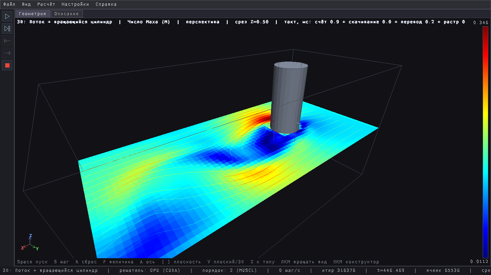

# PolluxCFD

2D and 3D Computational Fluid Dynamics application with CUDA support.

A compressible-flow solver (Euler and Navier–Stokes equations, finite volumes,
HLLC flux) with an interactive graphical interface: set up a problem, start the
solver and watch the field converge. Runs on Linux x86-64; the solver works on
the CPU (OpenMP) or on an NVIDIA GPU (CUDA). **The user interface and this
documentation are in Russian.** This repository holds the ready-to-run program
only — no source code.

---

**PolluxCFD** — решатель уравнений течения сжимаемого газа с графическим
интерфейсом. Задача — это область, тела в ней, граничные условия и параметры
потока. Её открывают из файла или собирают мышью, запускают счёт и смотрят
поле в цвете, пока оно сходится. Считает на процессоре или на видеокарте
NVIDIA, переключаясь на ходу.

В этом репозитории лежит готовая к запуску программа: исполняемый файл,
примеры задач и документация. Исходников здесь нет.

## Как это выглядит



**Профиль NACA 0012 в трансзвуковом потоке**, M=0.8, угол атаки 1.25°, поле
числа Маха. Над крылом — сверхзвуковая зона, которую замыкает скачок
уплотнения. Пример `cases/naca0012_transonic.cfd`, неявная схема LU-SGS,
невязка 8·10⁻⁵.



**То же обтекание — поле давления.** У носика поток тормозится, и давление
там в полтора раза выше набегающего. Над крылом — разрежение, которое скачок
обрывает резким подъёмом давления. К задней кромке давление восстанавливается.



**Центробежный компрессор: рабочее колесо в спиральном корпусе (улитке)**,
13000 об/мин, поле давления в срезе по середине колеса. Давление дано в долях
давления на входе. Воздух входит вдоль оси в центр колеса, и там давление чуть
ниже входного, 0.99: колесо засасывает воздух. Лопатки отбрасывают его к
периферии, и давление растёт по радиусу: у концов лопаток 1.05, в улитке 1.07.
В расширяющемся выходном канале поток тормозится, и давление доходит до 1.11:
компрессор поднимает его на 11 %. Серым закрашен металл корпуса. Пример
`cases3d/volute.cfd3d`, 912 тысяч ячеек, счёт на видеокарте, момент t=25
(колесо сделало шесть оборотов).



**То же течение — число Маха.** Быстрее всего воздух движется у концов
лопаток, до M=0.4. В выходном канале он идёт уже при M≈0.1: расширяющийся канал
тормозит поток, и скорость, которую воздуху дало колесо, переходит в давление.



**Вращающийся цилиндр в потоке M=0.3** (20000 об/мин), число Маха и линии
тока. Вращение увлекает поток, и след за цилиндром отклоняется в сторону —
это эффект Магнуса. Пример `cases3d/magnus.cfd3d`, счёт на видеокарте.

## Возможности

- **2D.** Метод конечных объёмов на неструктурированной треугольной сетке:
  триангуляция Делоне с релаксацией Ллойда и сгущением у тел. Поток через
  грань — HLLC. Второй порядок (MUSCL с ограничителем). Явная и неявная
  (LU-SGS) схемы, вязкие члены (Навье—Стокс), вращающееся рабочее колесо,
  готовые сетки `.ugr`.
- **3D.** Грань-ориентированный метод конечных объёмов, HLLC, второй порядок,
  вязкость. Тела в потоке: сфера, брусок, цилиндр, улитка и деталь из
  САПР (STEP). Тела могут вращаться. Входные условия — набегающий поток или
  резервуар. Поле показывается срезом, объёмным видом, линиями тока или
  изоповерхностью.
- **Счёт идёт в фоновом потоке**, окно при этом не замирает. Считать можно на
  процессоре (OpenMP) или на видеокарте (CUDA), переключаясь во время работы.
- **Конструктор задач.** В 2D фигуры ставят и двигают мышью, сетку сгущают
  щелчком. В 3D собирают тела и сборки или импортируют деталь из STEP.

## Что нужно для запуска

| | |
|---|---|
| Система | Linux x86-64 с glibc 2.38 или новее: Ubuntu 24.04, Linux Mint 22, Debian 13, Fedora 39 и новее |
| Библиотеки | SDL2, OpenMP (libgomp), libstdc++ из GCC 11 или новее |
| Видеокарта | не обязательна. Для счёта на GPU нужна NVIDIA с compute capability 8.6 или выше (RTX 30xx и новее) и драйвер 525 или новее |

CUDA Toolkit ставить не нужно: библиотека CUDA runtime лежит в `lib/`. Без
видеокарты программа считает на процессоре.

Недостающие библиотеки в Ubuntu, Mint и Debian ставятся одной командой:

```sh
sudo apt install libsdl2-2.0-0 libgomp1
```

## Установка и запуск

```sh
git clone https://github.com/TchDuke/PolluxCFD.git
cd PolluxCFD
./PolluxCFD.sh
```

Запускайте программу через `PolluxCFD.sh`. Он переходит в каталог программы
(примеры и шрифт ищутся относительно него) и подключает библиотеку CUDA из
`lib/`. Скрипт можно вызывать из любого каталога и по ссылке.

При первом запуске окно пустое. Откройте пример: **Файл → Открыть проект...**
(`Ctrl+O`), каталог `cases`, например `cylinder_m2.cfd`. Прочитайте вкладку
«Описание» и запустите счёт: **Расчёт → Запустить симуляцию**. Справка по
программе — клавиша `F1`.

## Что лежит в каталоге

| Путь | Что это |
|---|---|
| `PolluxCFD.sh` | запуск программы |
| `PolluxCFD` | исполняемый файл |
| `lib/` | CUDA runtime (`libcudart.so.12`) |
| `assets/` | шрифт интерфейса |
| `cases/` | 2D-задачи (`.cfd`) |
| `cases3d/` | 3D-задачи (`.cfd3d`) и детали STEP для импорта |
| `grids/` | готовые сетки `.ugr`, на которые ссылаются 2D-задачи |
| `docs/guide.md` | руководство: окно, меню, счёт, конструктор, горячие клавиши |
| `docs/file-formats.md` | форматы файлов задач |
| `THIRD_PARTY.md` | сторонние компоненты и их лицензии |

Настройки окна и путь к последней открытой задаче программа хранит рядом с
собой, в скрытом каталоге `.cfd2d/`. Чтобы начать с чистого листа, удалите его.

## Примеры

**2D (`cases/`)**

| Файл | Задача |
|---|---|
| `cylinder_m2.cfd` | цилиндр при M=2: отошедший головной скачок |
| `wedge_m3.cfd` | клин при M=3: присоединённый косой скачок |
| `sod_tube.cfd` | задача Сода (ударная труба), нестационарная, с точным решением |
| `two_bodies.cfd` | брусок под 25° и цилиндр в его аэродинамической тени, M=2 |
| `wind_tunnel.cfd` | сверхзвуковой канал M=2 с цилиндром |
| `impeller_rotor.cfd` | вращающееся рабочее колесо в покоящемся газе |
| `naca0012_transonic.cfd` | профиль NACA 0012, M=0.8, угол атаки 1.25°: скачок над крылом |
| `naca0012_subsonic.cfd` | тот же профиль без скачков, M=0.5, 3° — с него удобно начинать |
| `naca4415_wing.cfd` | несущий профиль NACA 4415, 5° |
| `channel_bump.cfd` | канал с горбом на стенке: внутреннее течение |
| `flat_plate_bl.cfd` | пластина: вязкий пограничный слой |
| `vki1_turbine_cascade.cfd` | турбинная решётка VKI-1: канал разгоняет поток до M≈1.5 |

**3D (`cases3d/`)**

| Файл | Задача |
|---|---|
| `body.cfd3d` | сфера в набегающем потоке M=0.5 |
| `magnus.cfd3d` | поток и вращающийся цилиндр: эффект Магнуса |
| `impeller.cfd3d` | центробежная ступень: вал и четыре лопатки, 13000 об/мин |
| `volute.cfd3d` | рабочее колесо в спиральном корпусе (улитке) |
| `box.step`, `cyl.step` | детали для **Файл → Импорт 3D тела...** |

Каждая задача несёт описание: оно открывается первой вкладкой.

## Если что-то не так

- **`error while loading shared libraries: libSDL2-2.0.so.0`** — не установлен
  SDL2: `sudo apt install libsdl2-2.0-0`.
- **`libcudart.so.12: cannot open shared object file`** — программу запустили
  напрямую, без `PolluxCFD.sh`. Запускайте через скрипт.
- **`version 'GLIBC_2.38' not found`** — система старее Ubuntu 24.04. Программе
  нужна glibc 2.38 или новее.
- **Окно пустое** — задача ещё не открыта: `Ctrl+O`, каталог `cases`.
- **«Не удалось включить GPU-решатель: CUDA-устройство недоступно»** — нет
  видеокарты NVIDIA или драйвера. Счёт продолжается на процессоре.
- **GPU-решатель на карте старше RTX 30xx** не поддерживается: не включайте
  его, считайте на процессоре.
- **Поле не меняется** — счёт на паузе, нажмите `Space`.
- **Невязка не падает** — уменьшите CFL или включите **Расчёт → Неявная схема**.
- **Счёт медленный** — уменьшите плотность сетки (**Настройки → Параметры
  проекта...**), для 3D включите GPU-решатель. Число потоков процессора по
  умолчанию не больше 8; задаётся переменной `OMP_NUM_THREADS`.

## Лицензии

Сетки в `grids/` взяты из программы Unstruct2D (© 1997–2014 J. Blazek) и
распространяются по GNU GPL v2. Библиотека `lib/libcudart.so.12` — компонент
NVIDIA CUDA runtime, распространяемый по лицензии NVIDIA CUDA Toolkit.
Подробности — в [THIRD_PARTY.md](THIRD_PARTY.md).
